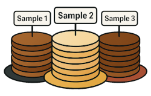

# Pankegg 
 
*A powerful parser and visualizer for metagenome bin annotation, classification, and quality assessment.*

Pankegg is a flexible and user-friendly interactive software suite built with Python, SQL, Jinja, JavaScript, and Flask, designed to visualize and compare bin annotations, taxonomic classifications, and quality metrics (estimated by CheckM2). It enables interactive exploration and comparison of results across bins and samples through a local web server interface.

Pankegg is ideal for anyone working with output files from CheckM2, EggNOG, Sourmash, or GTDB-TK. While it can be integrated into any workflow, it was originally conceived as the final step of the [MUFFIN pipeline](https://github.com/RVanDamme/MUFFIN) to provide a comprehensive visualization and analysis platform.


---

## Table of Contents

- [Quickstart](#quickstart)
- [Mission Statement](#mission-statement)
- [Introduction](#introduction)
- [Installation](#installation)
    - [Windows Subsystem for Linux](#windows-subsystem-for-linux)
- [Pankegg_make_db.py](#pankegg_make_dbpy)
    - [Supported Input Files](#supported_input_files)
    - [Usage Make DB](#usage-make-db)
    - [Parameters Make DB](#parameters-make-db)
    - [Output Make DB](#output-make-db)
    - [Test Make DB](#test-make-db)
- [Pankegg_app.py](#pankegg_apppy)
    - [Usage APP](#usage-app)
    - [Parameters APP](#parameters-app)
    - [Output APP](#output-app)
    - [Test APP](#test-app)
- [The Pankegg Web Page](#the-pankegg-web-page)
    - [Home](#home)
    - [Bin Information](#bin-information)
    - [Map Information](#map-information)
    - [KEGG Identifiers](#kegg-identifiers)
    - [Taxonomy](#taxonomy)
    - [Sample vs Sample](#sample-vs-sample)
    - [Bin vs Bin](#bin-vs-bin)
    - [Taxonomy Comparison](#taxonomy-comparison)
    - [PCA](#pca)
- [Reporting Bugs & Contributing](#reporting-bugs--contributing)
- [Authors and Contributors](#authors-and-contributors)
- [AI and LLM](#ai-and-llm)

---

## Quickstart

This quickstart guide will walk you through setting up Pankegg, running the pipeline on test data, and launching the web application to explore your results.

### 1. Install Pankegg and Dependencies

Install Pankegg via pip, conda, or pixi.  
See the [Installation](#installation) section for detailed options.

```bash
wget https://github.com/RVanDamme/PANKEGG/archive/refs/heads/master.zip
unzip master.zip
cd PANKEGG-master
pip install .
```

---

### 2. Download Example Test Data (optional)

Download and extract the example dataset:

```bash
wget https://osf.io/5v3zc/download -O pankegg_test_data.zip
unzip pankegg_test_data.zip
```

---

### 3. Build the SQL Database (optional) 

Generate a Pankegg database from the provided CSV using the included test data (for both Sourmash and GTDB-TK classification):

```bash
python pankegg_make_db.py -i pankegg_test_data/sourmash_example.csv -o test_sourmash --output_dir pankegg_test_data
```

---

### 4. Launch the Web Application

Start the web server using the database present in the repository:

```bash
python pankegg_app.py --d data/pankegg.db
```

or use the the database you generated in point 3:

```bash
python pankegg_app.py --d pankegg_test_data/test_sourmash
```

Now, open your web browser and go to the IP address written in your terminal ( [http://0.0.0.0:5000](http://0.0.0.0:5000)) to interactively explore your metagenomic data!

---

For more details, troubleshooting, or advanced options, see the [Usage and Tests](#usage-and-tests) section.


## Mission Statement

Pankegg aims to provide a comprehensive tool for the analysis and visualization of metabolic pathways across various samples and bins.  
Our goal is to facilitate research and understanding in the field of metagenomics and bioinformatics.

### Features and Benefits

- Compare samples and bins with ease
- Visualize taxonomic compositions
- Analyze pathway completions
- Export data for further analysis

---

## Introduction

Pankegg is composed of two main tools:  
- **Pankegg Make DB**, the data parser and SQL database creator ([Pankegg_make_db.py](#pankegg_make_dbpy)), which processes a CSV file where each line lists the required input files for a single sample. It compiles the information from these files into a structured SQL database, making downstream exploration fast and efficient,  and  
- **Pankegg APP**, the web server for interactive data exploration ([Pankegg_app.py](#pankegg_apppy)), which uses the database generated by the parser and provides an interactive browser-based interface to explore your results.

The web interface is divided into two main categories:
- **Navigation and Search:** Effortlessly browse and filter all available data to find exactly what you need.
- **Features:** Visualize data, compare bins or samples, and generate insightful plots.

#### Navigation and Search Pages

| Page Name  | Usage                                                                                                                            | Possible Filters                                      |
|------------|----------------------------------------------------------------------------------------------------------------------------------|-------------------------------------------------------|
| Bins       | Visualize all bins for each sample, review CheckM2 quality and classifications. Generate quality plots, see maps/KEGGs for bins. | Sample Name, Bin Name, Taxonomy, Maps, KEGGs          |
| Maps       | Visualize all pathways detected in your data, check pathway “completeness”, highlight orthologs present per pathway.             | Sample Name, Bin Name, Taxonomy, Map (ID/Name), KEGGs |
| KEGGs      | List all KEGGs present globally or in a specific bin; find patterns in ortholog/bin names.                                       | Ortholog Name Pattern, Bin Name (via Bins page)       |
| Taxonomy   | View tables for each taxonomic rank, listing taxons found and their abundance.                                                   | Taxonomic Rank                                        |

#### Feature Pages

Pankegg provides multiple interactive features:
- **Sample vs Sample:** Heatmap of selected pathways, scatter plots for bin quality, PCA of bins, tables/plots showing KEGGs unique or shared between samples/pathways.
- **Bin vs Bin:** Plot and table of KEGGs shared or unique between two bins for metabolic pathways.
- **Taxonomic Comparison:** For a given rank, see sample-wise composition plots (abundance = number of bins classified as taxon / total bins), and pathway-vs-taxa heatmaps.
- **PCA:** Dedicated page for visualizing principal component analysis (PCA) of each sample, based on KOs, maps, or taxonomy.

> **Note:**  
> In this documentation, the terms “map” and “pathway” are sometimes used interchangeably. Typically, “map” refers to the KEGG database’s map ID (e.g., `map00010`), while “pathway” refers to the biological pathway name. Although the KEGG database provides both a pathway ID and a map ID, this tool focuses on the map ID, which is generally more complete and reliable for referencing metabolic pathways.

---


## Installation

Installing Pankegg is simple. You can either download the repository as a zip file, or clone it using git.

### Download via wget or curl

You can download the repository as a zip file using `wget`:

```bash
wget https://github.com/RVanDamme/PANKEGG/archive/refs/heads/master.zip
unzip master.zip
cd PANKEGG-master
```
Or using `curl`:

```bash
curl -L https://github.com/RVanDamme/PANKEGG/archive/refs/heads/master.zip -o master.zip
unzip master.zip
cd PANKEGG-master
```

**OR**

### Clone via git

Alternatively, you can clone the repository directly using git:

```bash
git clone https://github.com/RVanDamme/PANKEGG.git
cd PANKEGG
```

---

### Install dependencies

You can install Pankegg and all necessary dependencies via **conda**, **pip**, or **pixi**.

#### Using conda

For a stable installation, use [conda-lock](https://github.com/conda/conda-lock) to create and activate a stable conda environment using the provided `conda-lock.yml` file (found in the `conda.recipe` directory):

```bash
conda-lock install --name pankegg_env conda-lock.yml
conda activate pankegg_env
```

Alternatively, create and activate a new conda environment using the provided `environment.yml` file (found in the `conda.recipe` directory):

```bash
conda env create -f environment.yml
conda activate pankegg_env
```


#### Using pip

From within the repository folder, install all dependencies by running:

```bash
pip install .
```

Or, install dependencies only:

```bash
pip install flask pandas numpy scikit-learn scipy jinja2 click setuptools importlib-metadata
```


#### Using pixi

If you use [pixi](https://prefix.dev/docs/pixi/), you can use the `pixi.lock` and run all the Pankegg commands with:

```bash
pixi run <pankegg_command>
```

### Windows Subsystem for Linux 

If you are using WSL, you should install Pankegg in the WSL itself and **NOT on your Windows drive**. This is required because of the disparity between the Linux FileSystem and the Windows FileSystem, which prevents the tools from running correctly through WSL when installed in the Windows FS.

We also recommend storing your database in the WSL rather than on your Windows drive. While this is not critical, it is a better practice and ensures that Pankegg will read the database properly.

---

### Running Pankegg

Once the installation is complete, you can run Pankegg using:

```bash
pankegg_make_db --help
pankegg_app --help
```

If the commands are not in your PATH then use the whole path to the executable.

For more detailed instructions on how to use Pankegg, see the [Usage and Tests](#usage-and-tests) section.


---

## Pankegg_make_db.py

### Supported Input Files

| Tool      | Input File (generic name) | Data Extracted |
|-----------|--------------------------|---------------|
| checkm2   | quality_report.tsv       | bin completeness and contamination              |
| Sourmash  | *.txt                    | ID, Status and Taxonomic classification         |
| GTDB-TK   | *.summary.tsv            | User genome and Taxonomic classification        |
| EggNOG    | *.annotations.tsv        | KEGG Orthologs, KEGG Pathways, GO terms, Description  |

#### Additional Input Files Provided by Pankegg

| File Name               | Description                                                                   | Data Origin                             |
|-------------------------|-------------------------------------------------------------------------------|-----------------------------------------|
| kegg_map_info.tsv       | Contains mapID, pathway name, and total number of orthologs per pathway (map) | Extracted from KEGG pathway database    |
| kegg_map_orthologs.tsv  | Contains mapID, pathway name, and list of orthologs per pathway (map)         | Extracted from KEGG pathway database    |
| ko.txt                  | Contains the IDs and names of orthologs                                       | Extracted from KEGG orthologs database  |
| pathway.txt             | Contains map IDs (pathways) and their names                                   | Extracted from KEGG pathway database    |
| pathway_groups.txt      | Maps IDs grouped by KEGG sub-categories                                       | Extracted from KEGG pathway database    |

---

### Usage Make DB

To create the SQL database, you will need a CSV file listing all your samples and their corresponding input directories or files.  
The expected CSV format uses the following header:

```
Sample name,Annotation_dir,classification_dir,Checkm2_dir
```

Each subsequent line represents a sample, and should look like one of the following examples:

- For Sourmash classification:
    ```
    SAMPLE1,/Path/to/SAMPLE1/bin_annotation/*.annotations.tsv,/Path/to/SAMPLE1/sourmash/*,/Path/to/SAMPLE1/checkm2_dir/quality_report.tsv
    SAMPLE2,/Path/to/SAMPLE2/bin_annotation/*.annotations.tsv,/Path/to/SAMPLE2/sourmash/*,/Path/to/SAMPLE2/checkm2_dir/quality_report.tsv
    ```

- For GTDB-TK classification (when using the `--gtdbtk` flag):
    ```
    SAMPLE1,/Path/to/SAMPLE1/bin_annotation/*.annotations.tsv,/Path/to/SAMPLE1/gtdb_results/*.summary.tsv,/Path/to/SAMPLE1/checkm2_dir/quality_report.tsv
    SAMPLE2,/Path/to/SAMPLE2/bin_annotation/*.annotations.tsv,/Path/to/SAMPLE2/gtdb_results/*.summary.tsv,/Path/to/SAMPLE2/checkm2_dir/quality_report.tsv
    ```

You can create this CSV file automatically with a bash loop, depending on how your data are organized:

- **If your results are grouped by sample:**

    ```
    Dir/
      SAMPLEID1/
        bin_annotation/
        sourmash/
        gtdb_results/
        checkm2_dir/
      SAMPLEID2/
        ...
    ```
For Sourmash

    ```bash
    echo "Sample name,Annotation_dir,classification_dir,Checkm2_dir" > samples.csv
    for sample in Dir/*; do
        name=$(basename "$sample");
        ann_path="$sample/bin_annotation/*.annotations.tsv";
        class_path="$sample/sourmash/*";
        checkm2_path="$sample/checkm2_dir/quality_report.tsv";
        echo "$name,$ann_path,$class_path,$checkm2_path" >> samples.csv;
    done

    ```
For GTDBTK

    ```bash
    echo "Sample name,Annotation_dir,classification_dir,Checkm2_dir" > samples.csv
    for sample in Dir/*; do
        name=$(basename "$sample");
        ann_path="$sample/bin_annotation/*.annotations.tsv";
        class_path="$sample/gtdb_results/*.summary.tsv";
        checkm2_path="$sample/checkm2_dir/quality_report.tsv";
        echo "$name,$ann_path,$class_path,$checkm2_path" >> samples.csv;
    done
    ```


- **If your results are grouped by tool, then sample:**

    ```
    Dir/
      bin_annotation/
        SAMPLEID1/
        SAMPLEID2/
        ...
      sourmash/
        SAMPLEID1/
        SAMPLEID2/
        ...
      gtdb_results/
        SAMPLEID1/
        SAMPLEID2/
        ...
      checkm2_dir/
        SAMPLEID1/
        SAMPLEID2/
        ...
    ```

For Sourmash

    ```bash
    echo "Sample name,Annotation_dir,classification_dir,Checkm2_dir" > samples.csv
    for sample in Dir/bin_annotation/*; do
        name=$(basename "$sample");
        ann_path="Dir/bin_annotation/$name/*.annotations.tsv";
        class_path="Dir/sourmash/$name/*";
        checkm2_path="Dir/checkm2_dir/$name/quality_report.tsv";
        echo "$name,$ann_path,$class_path,$checkm2_path" >> samples.csv;
    done
    ```
For GTDBTK

    ```bash
    echo "Sample name,Annotation_dir,classification_dir,Checkm2_dir" > samples.csv
    for sample in Dir/bin_annotation/*; do
        name=$(basename "$sample");
        ann_path="Dir/bin_annotation/$name/*.annotations.tsv";
        class_path="Dir/gtdb_results/$name/*.summary.tsv";
        checkm2_path="Dir/checkm2_dir/$name/quality_report.tsv";
        echo "$name,$ann_path,$class_path,$checkm2_path" >> samples.csv;
    done
    ```

---

### Parameters Make DB

- `-i, --input`  
  Path to the CSV file listing all samples and their input files/directories (required).

- `-o, --output`  
  Name of the output database file (**without the extension**). The default is `pankegg`. The `.db` extension is automatically added to the output name.

- `--output_dir`  
  Directory the database will be written to. The default is `./db_output`.

- `--gtdbtk`  
  Use this flag if your classification files were generated with GTDB-TK instead of Sourmash.

---

### Output Make DB

The output is an SQLite database (`*.db`) that can be opened with tools like `sqlite3`, but is best used with `pankegg_app.py` for interactive browsing.  
The database contains the following tables:

- `taxonomy`
- `bin`
- `map`
- `kegg`
- `bin_map_kegg`
- `bin_map`
- `map_kegg`
- `bin_extra`
- `bin_extra_kegg`
- `sample`

Each table stores specific information related to bins, pathways, taxonomy, and annotation results for easy querying and visualization.

---

### Test Make DB
To verify your installation and familiarize yourself with Pankegg, you can run a test using provided data. Download the example archive, unzip it, and generate test databases using the included CSV files:

- Download the test data archive from OSF (https://osf.io/wjuet):

    ```bash
    wget https://osf.io/download/5v3zc/ -O pankegg_test_data.zip
    ```

    OR

    ```bash
    curl -L -o pankegg_test_data.zip  https://osf.io/download/5v3zc/
    ```

- Unzip the archive (creates a directory called `pankegg_test_data`):

    ```bash
    unzip pankegg_test_data.zip
    ```

- Create a test database for Sourmash classification:

    ```bash
    python pankegg_make_db.py -i pankegg_test_data/sourmash_example.csv -o test_sourmash --output_dir pankegg_test_data
    ```

- Create a test database for GTDB-TK classification:

    ```bash
    python pankegg_make_db.py -i pankegg_test_data/gtdbtk_example.csv -o test_gtdbtk --output_dir pankegg_test_data --gtdbtk
    ```

After running these commands, you should find newly created `test_sourmash.db` and `test_gtdbtk.db` inside the `pankegg_test_data` directory. This is in addition to the already existing `sourmash_example.db` and `gtdbtk_example.db` files in the same directory.
The existing and newly generated respective databases should be identical, so the validity of `pankegg_make_db.py` can be tested by comparing the two files.

---

For more details or troubleshooting, please consult the [Reporting Bugs & Requesting Addons](#reporting-bugs--requesting-addons) section.


---

## Pankegg_app.py

### Usage APP

Before running the web application, it is highly recommended to **change the `app.secret_key`** (found at line 50 in `pankegg_app.py`) to a secure value of your choice.  
This key is used by Flask for session security. Leaving it as the default ('local') is fine for local or testing use, but for any real-world or multi-user deployment, you should generate and use a strong, unique secret key to prevent session tampering and increase security.

To start the Pankegg web server with your database, use the following command (replace with your actual database path):

    ```bash
    python /path/to/pankegg_app.py --d /Path/to/YOUR_PANKEGG.db
    ```
    (Replace /path/to/pankegg_app.py and /Path/to/YOUR_PANKEGG.db with your actual paths.)

---

### Parameters APP

- `--d` or `--db`  
  Path to the SQLite database you want to browse.  
  Example: `--d /Path/to/YOUR_PANKEGG.db`

- `--help`  
  Display a help message with all available options.

---

### Output APP

By default, the web server will start on your local IP address (host `0.0.0.0`) and port `5000`.  
Once started, you can access the Pankegg interface in your browser by navigating to:

[http://0.0.0.0:5000](http://0.0.0.0:5000)

You will be able to browse, filter, and visualize all results contained in your selected database.

---

### Test APP

You can test the web interface using either the database provided with the repository, example databases from the test data, or your own generated databases.  
Here are example commands (replace BASH with the actual commands):

- To run the app on the database shipped with the GitHub repository (`data/pankegg.db`):

    ```bash
    python pankegg_app.py --d data/pankegg.db
    ```

- To run the app on the example Sourmash test database (`pankegg_test_data/sourmash_example.db`):

    ```bash
    python pankegg_app.py --d pankegg_test_data/sourmash_example.db
    ```

- To run the app on the example GTDB-TK test database (`pankegg_test_data/gtdbtk_example.db`):

    ```bash
    python pankegg_app.py --d pankegg_test_data/gtdbtk_example.db
    ```

- To run the app on the Sourmash database you created during the test (`pankegg_test_data/test_sourmash.db`):

    ```bash
    python pankegg_app.py --d pankegg_test_data/test_sourmash.db
    ```

- To run the app on the GTDB-TK database you created during the test (`pankegg_test_data/test_gtdbtk.db`):

    ```bash
    python pankegg_app.py --d pankegg_test_data/test_gtdbtk.db
    ```

For more details or troubleshooting, see the [Reporting Bugs & Contributing](#reporting-bugs--contributing) section.


---

## The Pankegg Web Page

*Overview of all web app pages.*

### Home

At the top, a navigation bar provides quick access to all major sections: Home, Bin, Map, Kegg, Taxonomy, and Visualisation. Each of these sections links to a page where you can browse detailed information about your bins, pathway maps, KEGG identifiers, and taxonomic classifications, or use the different interactive visualisation tools. The navbar ensures that you can switch between functional modules.

The landing page, `Home`, links to all elements that are also present in the navigation bar, and provides a short description for each one. Additionally, it shows the full content of the `Visualisation` page, Sample VS Sample; Bin VS Bin; Taxonomy comparison; PCA, and briefly describes each one.


---

### Bin

The `Bin` information page allows you to view and manage all bins in your project, organized by sample. At the top, you will find options to toggle **the visibility** of all bins or all **taxonomy classifications** with a single click.

A panel provides advanced **sorting, search, and filtering** options:
- **Sort by** Bin Name, Completeness, or Contamination.
- **Filter/search** by sample name, bin name, or any taxonomic rank (Kingdom, Phylum, Class, Order, Family, Genus, Species). By default the search is on the sample name and bin name, for filtering by taxonomic rank select one or more before searching.
- **GTDB quality filtering** can be enabled to display only the bins passing Genome Taxonomy DataBase selection criteria (completeness - 5*contamination >50).


Each bin is displayed in a table below its Sample Name, with columns for bin name, genus, species, completeness, and contamination.  
For each bin, you can:
- **View associated maps (pathways)** or **KEGG orthologs** with a single click.
- **Toggle taxonomy classification** to expand or collapse the display of detailed taxonomic information.
- **Generate a quality plot** for the bins in a sample.

These features make it easy to explore, filter, and compare bin quality and taxonomy across all your samples.


---

### Map

The `Map` information page gives you an overview of all metabolic pathways (KEGG maps) present in your dataset. Each pathway is listed with its map number, pathway name, and a completion percentage, which indicates the proportion of KEGG orthologs (KOs) found in your data relative to the total number of KOs for that pathway.

At the top of the page, you’ll find options to toggle all map details and export your current view. The legend explains how KOs are visualized:
- **Dark blue**: KEGG ID officially present in the pathway
- **Light blue**: KEGG ID not officially present in the pathway

*Note: Not all KOs contribute equally to pathway function, so this value is only an approximate indicator.*

#### Filtering and Search

You can filter maps by sample, bin, pathway name, or KO identifier using the controls above the table. When filtering by bin or sample, the pathway completion percentage is recalculated to only include the KOs found within the selected bin(s) or sample(s), providing a focused view of its metabolic potential.

#### Viewing KO Details

For each pathway, you can toggle the display of all detected KO IDs. This expands the row to show the full list of associated KEGG orthologs, with coloring based on their official status in the pathway.

If you filter through KO IDS, the filtered KO will be highlighted in orange to differentiate it from all the other KO IDs.


#### KEGG Info and Pathway Highlighting

The “KEGG info” button provides a direct link to the pathway’s entry on the KEGG website for further reference.

The “Highlight pathways” button opens a sidebar slider with all relevant KO IDs for the selected pathway. You can quickly copy these IDs and use them in the KEGG color tool to generate a custom view of the pathway map on the KEGG website. The KOs found in your current data will then be highlighted with color.

This combination of interactive filtering, KO details, and external links makes it easy to explore pathway presence, completion, and functional highlights across all your bins and samples.


For examples the (Carbon Metabolism pathway)[https://www.kegg.jp/pathway/map01200] for Sample 1 and 3 of the test data contains:


---

### KEGG

The `KEGG` page provides an overview of all KEGG orthologs (KO IDs) detected in your dataset. The main table displays, for each KEGG ortholog (KO), its ID, KO name, and a full name/description. You can use the search bar at the top to filter the KEGG IDs.

You see the complete list of KOs across your entire project, with quick-access buttons to:
- **View Bins:** Show which bins contain the selected KO.
- **View Maps:** See which metabolic pathways (maps) include the selected KO.
- **View Details:** Expand to show detailed information for each bin and sample in which the KO is present, including associated GO terms and EggNOG annotations, if available.
- **KEGG info:** Open the corresponding KO entry on the KEGG website for more detailed biological context.

When you apply filters on the `Bin` page, the KEGG Identifiers view will display only those KOs present in the selected bin, helping you focus on its functional profile.

Beware that when viewing the details of KOs you can have multiple entries within the same bin as we parse the entire EggNOG annotation file and those files can be redundant.

All action buttons are designed for seamless exploration: filter bins and maps based on any KO of interest, or instantly jump to its external reference.


---

### Taxonomy

The Taxonomy page allows you to explore the taxonomic composition of your dataset at any rank (such as phylum, class, order, etc.) by simply selecting the desired taxonomic level from the dropdown menu at the top of the page. The resulting table lists all taxons detected at that rank, alongside the number of bins classified under each taxon.

The "unclassified" taxons are qualified in this table as their rank letter followed by 2 underscore (e.g. S__).

For each taxon, you have quick access buttons to:
- View only the **bins** classified as this taxon,
- See the **maps** (metabolic pathways) found in those bins,
- Browse the **KEGG orthologs** associated with this taxon.

This makes it easy to drill down into the taxonomic groups of interest and immediately access qualitative and pathway-related information for any selected group.


---

### Sample vs Sample

The Sample vs Sample page enables detailed comparison between any two selected samples in your dataset.

To begin, choose two samples from the dropdown menus. The page then displays a suite of visualizations and tables to help you interpret differences and similarities:

- **Heatmap:**  
Select a pathway category to visualize completion levels for each bin and each pathway in both samples. Pathway completion is shown as a heatmap—bins with more complete pathways are colored closer to red, while less complete pathways are closer to blue. You can also select multiple pathway categories. Each category is plotted individually and displayed underneath each other. 
*Note: Completion is calculated as the proportion of orthologs detected in each bin out of the total number required for the pathway.*

- **Scatterplot:**  
  The bin quality scatterplot shows, for each sample, the completeness versus contamination for all bins, allowing quick assessment of bin quality distribution within and between samples.

- **Bin PCA:**  
  PCA (Principal Component Analysis) plots are generated for all bins in each sample, displaying the distribution of bins in reduced dimensionality space. This highlights similarities or differences in bin composition and functional potential. 
*Note: This should only be used if there are sufficient amount of bins provided, a PCA on e.g. 3 bins has no value*

- **Common Pathways:**  
  A table lists all detected pathways, with counts of shared and unique orthologs for each sample. You can filter pathways using the search bar. Below, a barplot provides a visual summary of these counts, making it easy to spot pathways enriched or unique to each sample.

These combined tools offer a comprehensive, multi-angle comparison of the functional and taxonomic profiles of your samples.


---

### Bin vs Bin

The Bin vs Bin comparison page allows you to directly compare the metabolic potential of any two bins, whether they belong to the same sample or different samples. After selecting two bins, the page displays a comprehensive table listing all metabolic pathways, showing the count of orthologs detected in both bins, or uniquely in each bin. You can use the search bar to filter pathways of interest.

Below the table, a barplot visually summarizes these pathway counts, making it easy to identify pathways that are shared or unique to each bin.

This focused comparison makes it simple to explore functional similarities and differences between any two specific genome bins in your dataset.


---

### Taxonomy Comparison

The Taxonomy Comparison page allows you to compare the taxonomic composition and metabolic potential of your samples at any chosen rank (such as phylum, class, or order). After selecting a rank, a barplot displays the percentage of bins belonging to each taxon across all samples. 
*Note: The percentages are calculated as the number of bins for each taxon divided by the total number of bins in each sample.*

Below, a heatmap visualizes the number of bins present at specific metabolic pathways for each taxon at the selected rank. Pathways (rows) are compared against taxonomic groups (columns), with color indicating the number of bins: red signifies higher number of bins, while blue indicates lower number of bins.

These combined visualizations help you quickly assess both the taxonomic structure and functional diversity present in your data.


---

### PCA

The PCA page provides Principal Component Analysis (PCA) visualizations to help you explore the global structure and relationships in your dataset. You can choose to perform PCA based on one of three categories:
- **KEGG Orthologs (KO):** The samples are differentiated based on their KO content.
- **Metabolic Pathways (Maps):** Uses pathway presence as the feature for the PCA.
- **Taxonomic Classification:** Allows you to select a specific rank (such as phylum, class, order, etc.) and projects the samples based on taxonomic composition.

The resulting PCA plot visualizes your samples in a reduced dimensional space, helping to highlight patterns, clusters, or differences driven by functional or taxonomic profiles. The explained variance for the principal components is displayed below the plot to indicate how much of the data's variation is captured.
*Note: We recommand using this tool only if you have enough samples.*


---


## Reporting Bugs & Contributing

Contributions from the community are welcome ! See the [Contributing guidelines](CONTRIBUTING.md)

## Authors and Contributors

Renaud Van Damme (@RVanDamme)
Arnaud Vanbelle (@Avanbelle)

---

## AI and LLM

AI/LLM were used as "writing buddy" during the redaction of the README.md (e.g. ensuring a readable markdown structure and correcting the syntax/grammar).
The logic and code were initially made by humans (@RVanDamme and @Avanbelle), before using AI/LLM on the code to debug and refactor it. 
